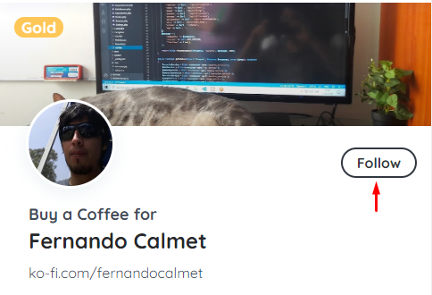
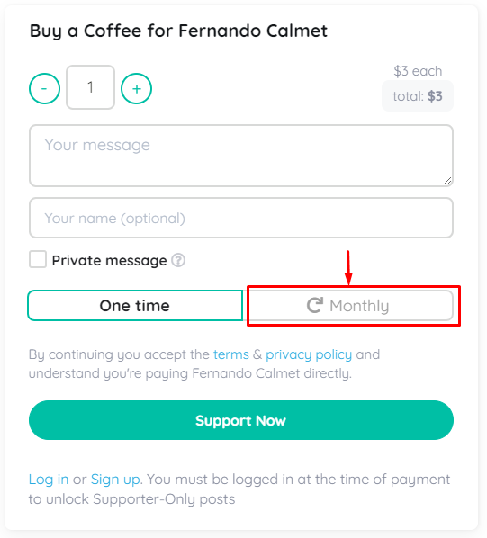

# Overview

{: .fs-4 }
Tantra Online is a simple, fast paced 3D MMORPG set in an oriental fantasy world. Set in an oriental environment with 8 playable tribes and a PvP focused gameplay. With a high experience rate and simple combat, Tantra is easy to jump into.

Documentation to manage and administer your own online server.
{: .fs-6 .fw-300 }

[Get started now](#getting-started){: .btn .btn-primary .fs-5 .mb-4 .mb-md-0 .mr-2 } [Get Private Support](https://ko-fi.com/fernandocalmet/commissions){: .btn .fs-5 .mb-4 .mb-md-0 }

---

## Getting started

### Dependencies

- [Windows Server](https://www.microsoft.com/windows-server) 2008 or high
- [SQLServer](https://www.microsoft.com/sql-server) 2008 or high
- [Apache Server](https://httpd.apache.org) / [XAMPP](https://www.apachefriends.org) / [WAMPP](https://www.wampserver.com)

### How to get the required files?

1. [Register](https://www.ko-fi.com) on ko-fi page

2. [Follow](https://ko-fi.com/fernandocalmet) to the developer page

3. Get your [Commission](https://ko-fi.com/fernandocalmet/commissions) package for Tantra Online for a single payment. This package allows you to access the private repository for Tantra Online + Private chat / email support with the responsible developer.

4. [Subscribe](https://ko-fi.com/fernandocalmet) for a month to have the commission package privileges for Tantra Online

<small style="color:#FF5E5B">While you have your active subscription the privileges of the commission are maintained. If you no longer want to continue with this privilege you can cancel the payment whenever you want from your paypal page.</small>

### Configure Game Server

- [See configuration options]({{ site.baseurl }})

---

## About the project

Khanakat is &copy; 2010-{{ "now" | date: "%Y" }} by [Fernando Calmet](https://ko-fi.com/fernandocalmet).

### License

Just the Docs is distributed by an [MIT license](https://github.com/khanakat/TantraOnline/blob/master/LICENSE.txt).

#### Thank you to the contributors of Just the Docs!

<ul class="list-style-none">

  <li class="d-inline-block mr-1">
     
  </li>

</ul>

### Code of Conduct

Just the Docs is committed to fostering a welcoming community.

[View our Code of Conduct](https://github.com/pmarsceill/just-the-docs/tree/master/CODE_OF_CONDUCT.md) on our GitHub repository.
